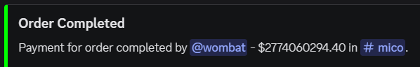
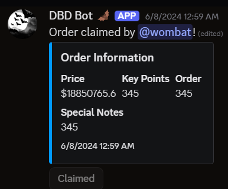
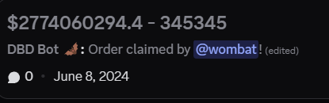

# DBD Bot  Ticketing and Payments

DBD Bot is a Discord ticketing bot that streamlines order intake, routing, and fulfillment. It also processes transactions and supports multiple payment flows, enabling staff to claim, complete, and settle orders efficiently.

This bot uses Discord forum threads, buttons, and modals to capture order details, move tickets through categories, enforce simple role-based rules, and post payment summaries when work is completed.

## What It Does

- Creates tickets via modal forms for standard, discounted pass, and friend-add orders.
- Publishes order cards to forum channels with a Claim Order button that updates the card and routes the ticket to the correct category.
- Manages access in channels/threads so the claimer can work the order; restricts users after completion and schedules cleanup.
- Calculates custom prices from inputs; includes a separate calculator for trophy/rank-based pricing.
- Posts payment due messages to dedicated payment channels once the order is completed.

## Features & Commands

All commands are built with slash commands and many are restricted to staff roles. Command names reflect the files under `commands/`.

- `payments`  Setup the payment buttons in the current channel. Sends an embed with PayPal and Cash App buttons for customers to pick a payment method. (commands/payments.js:6)
- `orders paid`  Opens a modal to mark an order as paid and prompt for details like price, key points, order, notes, and region. Triggers the ticketing flow. (commands/orderspaid.js:6)
- `cheap`  Handles discounted pass offers via a modal capturing price and order details, then publishes a claimable thread to the designated forum. (commands/brawlpassplus.js:6)
- `addfriend`  Handles friend-add offers via a modal capturing price and order details, then publishes a claimable thread to the designated forum. (commands/friendadd.js:6)
- `customer`  Assigns the configured Customer role to a user; requires either Mod perm or a specific seller role. (commands/customer.js:6)
- `move`  Moves a channel into a specified category; defaults to the current channel if not provided. (commands/move.js:2)
- `calculate`  Calculates order pricing between trophy/rank ranges; supports ranked vs ladder and optional carry pricing. Autocomplete for common ranks. (commands/calculate.js:1)
- `credits add|remove|show`  Manages a simple credits balance stored in MongoDB for a user. Restricted to Head Staff/Owner for adding; removal/show available per implementation. (commands/credits.js:1)
- `permissions grant|revoke`  Grants or revokes a users permissions in a channel (view/send/read-history). (commands/permisisons.js:1)
- `ping`  Sends periodic pings (`@everyone`) to a channel at a specified interval and auto-deletes ping messages shortly after sending. (commands/ping.js:1)

### Buttons & Modals (Core Flow)

- `Claim Order` button  Present on posted order threads; when clicked, updates the thread UI to Claimed, moves the original ticket channel to a working category, grants the claimer permissions, and pins order info. Specialized handling exists for standard, pass, and friend orders. (components/buttons/claimOrder.js:1)
- `Order Completed` button  After work is done, moves the working channel to a final category, revokes claimer perms, posts a payment-summary embed to the appropriate payments channel, schedules deletion in 12 hours, and notifies back in the original thread. (components/buttons/orderCompleted.js:1)
- Modals  Used to capture initial ticket data for standard orders, pass orders, and friend-add orders; compute net price; and publish claimable forum threads with embeds and action rows. (handlers/modalSubmit.js:1)

## Images (assets)

Below are the assets used for order/ticket embeds and post-order visuals.

  
*Example embed shown when an order has been completed and a payment summary is generated.*

  
*Example of the Order Information embed published to a forum thread for staff to claim.*

  
*Example of a post-order channel view after claim, showing context and pinned details.*

## How It Works (High Level)

- Order intake: Staff use slash commands that open a modal where details are entered. The bot posts a formatted embed plus a Claim button to the relevant forum channel.
- Claim: A staff member clicks Claim, the thread/message updates, and the original ticket channel is moved to the appropriate working category with permissions granted to the claimer.
- Completion: Staff click Order Completed to lock down access, move the channel to final category, post a payment record in a payments channel, and schedule cleanup.
- Persistence: MongoDB stores lightweight keys for mapping thread/channel/post and price-after-cut. Redis is used for time-based cleanup keys and periodic polling for channel deletions.

## Environment & Setup

- Requires a Discord bot token and multiple role/channel/category IDs used in routing and permissions (see variables referenced throughout `handlers/` and `components/buttons/`).
- Uses MongoDB for state and Redis for ephemeral scheduling. Ensure both are reachable via your environment configuration.
- Start the bot: `node index.js` (ensure `.env` is populated and dependencies installed).

## Notes

- Many actions are restricted by role/permission. This was originally a Discord bot tailored for a specific server with robust IAM perms.
- Payment options can be initialized with the `payments` command; actual payment processing hooks are represented by buttons and follow-up flows inside your server.
